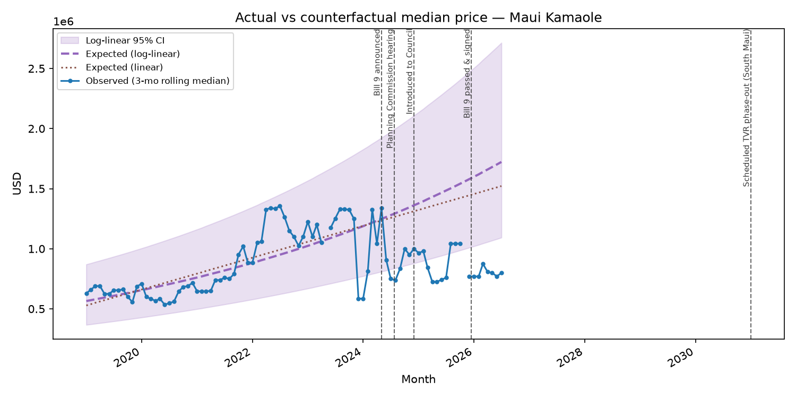
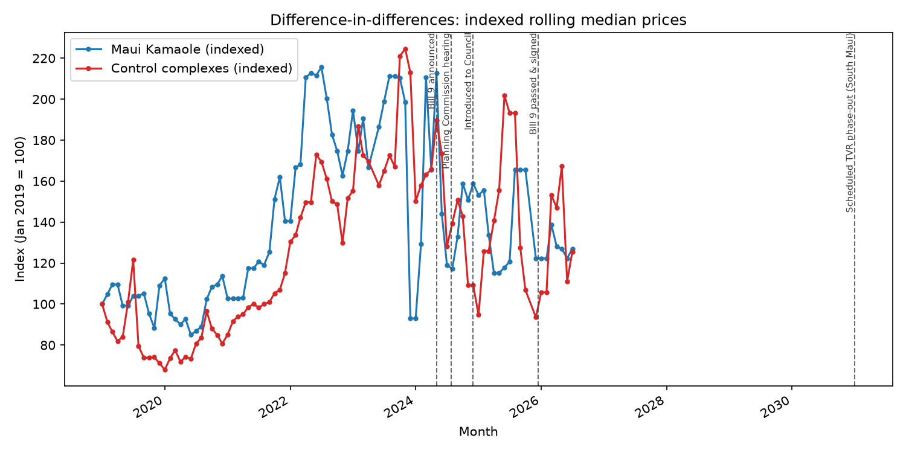
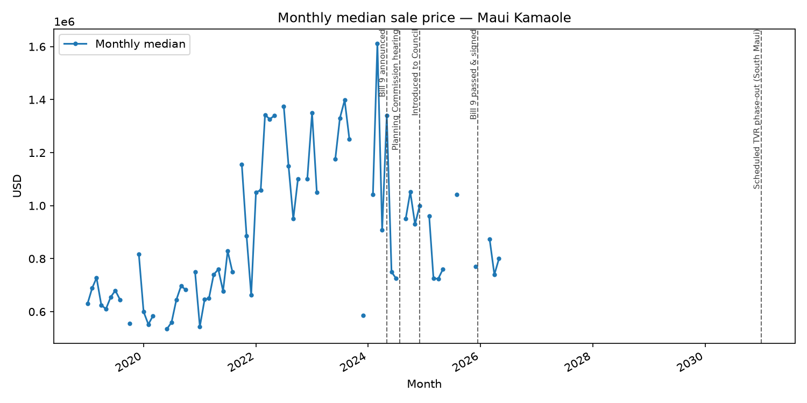
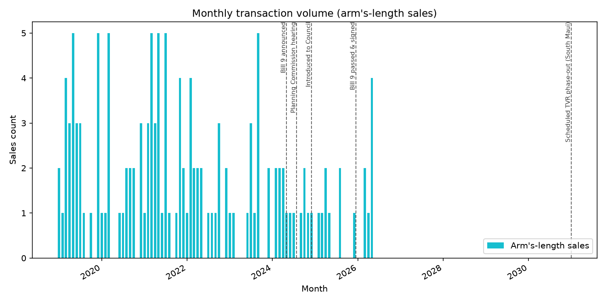
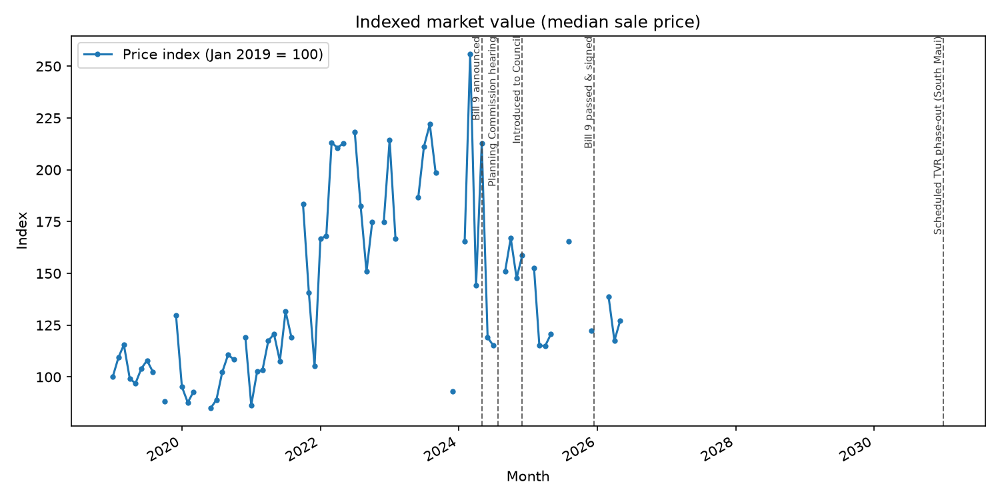
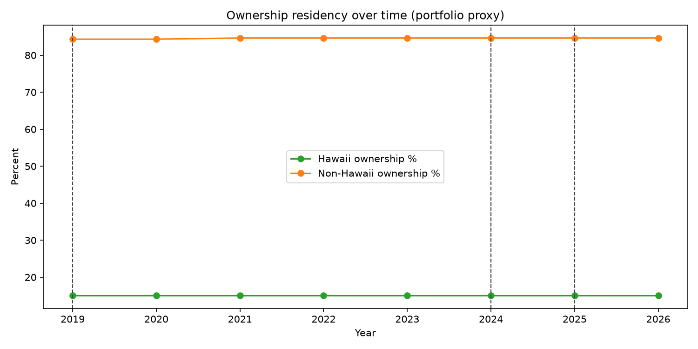

# Market Response to Maui County Bill 9 — Maui Kamaole Event Study (2019–Present)

*Generated 2026-07-15*

> **Interpretation notice:** This event study presents observed market patterns around Maui County Bill 9 milestones. Residency uses current fullownr mailing addresses as a proxy for owners — not historical buyer residency at each sale. Price metrics use arm's-length fee conveyances above $10,000. Correlation does not establish causation; external factors include mortgage rates, insurance costs, wildfire recovery, tourism demand, and broader Maui housing conditions.

## 1. Executive Summary

Maui Kamaole (239004082,239004143,239004144) comprises 316 condominium units. From 2019/01/01 through 2026/07/15, county records show **217 transfers** and **139 arm's-length sales**.

- Median sale price (study period): $790,000
- Portfolio ownership (proxy): 15.0316% Hawaii / 84.6519% non-Hawaii
- Transfers attributed to non-Hawaii owners (dominant proxy): 82.4885%

**Counterfactual (log-linear trend):** Based on Maui Kamaole's pre-announcement appreciation trend, the median unit would have been expected to sell for approximately **$1,722,353** by 2026-07. The observed rolling median of **$800,000** is **$922,353** below that forecast (53.6% below expected), equivalent to approximately **$291,463,624** across the complex. This assumes pre-announcement trends would otherwise have continued; the 2021–2022 price spike makes log-linear extrapolation sensitive — see linear model and fixed-rate sensitivity below.

### Policy timeline

| Date | Event |
|------|-------|
| 2019-01-01 | Baseline |
| 2024-05-01 | Bill 9 announced |
| 2024-07-25 | Planning Commission hearing |
| 2024-12-01 | Introduced to Council |
| 2025-12-15 | Bill 9 passed & signed |
| 2031-01-01 | Scheduled TVR phase-out (South Maui) |

## 2. Counterfactual Market Value Analysis (Section 15)

A simple pre/post median comparison can understate deviation from the market trajectory owners might have expected. This section compares **observed** sale prices to a **counterfactual** forecast fitted on pre-announcement data (January 2019 through April 2024).

| Model | Expected median | Notes |
|-------|-----------------|-------|
| Log-linear (primary) | $1,722,353 | Implied pre-period CAGR: 16.0184%/yr |
| Linear | $1,521,752 | Dollar-per-month trend |

### Fixed-rate sensitivity (illustrative)

If pre-announcement median had compounded at fixed annual rates from the last pre-announcement month:

| Annual rate | Years | Expected median |
|-------------|-------|-----------------|
| 3.0000% | 2.25 | $1,114,191 |
| 5.0000% | 2.25 | $1,163,461 |
| 7.0000% | 2.25 | $1,213,919 |
| 8.0000% | 2.25 | $1,239,594 |

**Difference-in-differences:** Treatment log-price change minus pooled controls (221008083, 221008082) implies an approximate **-5.39%** differential on price levels after the announcement. See `bill9-counterfactual.csv` model=`did`.

> Counterfactual estimates are **descriptive**. They measure deviation from a pre-announcement trend, not proof that Bill 9 caused the gap.

## 3. Market Activity

Monthly transfers, arm's-length sales, and price indices are in `bill9-monthly-market.csv`.

## 4. Ownership & Residency

Portfolio non-Hawaii ownership was 84.3354% in 2019 and 84.6519% in 2026 (year-end proxy). Non-Hawaii share among transfers: 88.5714% → 80.0000%.

Buyer residency among transfers uses the current owner mailing-address proxy. See `bill9-monthly-residency.csv`.

## 5. Supporting Evidence

**Price distribution:** Pre-announcement median $795,000 (116 sales) vs post-announcement through passage $765,000 (16 sales). See `bill9-price-distribution.csv`.

**Repeat sales:** 27 consecutive arm's-length pairs in `bill9-repeat-sales.csv`.

**Turnover:** 2026 turnover rate 3.1646% (10 unique units). See `bill9-turnover.csv`.

**Statistical tests (Mann-Whitney, pre- vs post-announcement):** sale_price: cannot reject equal distributions at alpha=0.05 (p=0.475094); monthly_transfer_count: reject equal distributions at alpha=0.05 (p=0.002064); monthly_non_hi_pct: cannot reject equal distributions at alpha=0.05 (p=0.120095). See `bill9-statistics.csv`.

## 6. Limitations

- Residency is inferred from current mailing address rather than historical residence at purchase.
- Mailing address is a proxy and may not reflect actual occupancy.
- Correlation does not establish causation.
- External factors include mortgage rates, insurance costs, wildfire recovery, tourism demand, and broader Maui housing conditions.
- Results are limited to Maui Kamaole and should not be generalized to all South Maui properties.
- Interior square footage and floor-plan attributes are not available in county extracts; comparable-unit analysis uses TMK, building letter, and assessed building-value bucket proxies. Price-per-square-foot metrics are omitted when sqft is unavailable.

- Counterfactual forecasts extrapolate Maui Kamaole's pre-announcement price trend and assume it would have continued absent Bill 9 or other shocks.
- Pre-announcement data include the 2021–2022 price spike; linear and log-linear models respond differently to that volatility.
- Months with few sales leave observed medians missing; the expected path is model-based.
- Difference-in-differences results require comparable control complexes with prepared county sales data.
- Counterfactual gaps are descriptive and do not establish that Bill 9 caused the deviation.

## 7. Data Files

- `bill9-event-study-summary.csv` — top-line and counterfactual headline metrics
- `bill9-counterfactual.csv` — monthly expected vs observed medians (linear & log-linear)
- `bill9-monthly-market.csv`
- `bill9-monthly-residency.csv`
- `bill9-repeat-sales.csv`
- `bill9-comparable-units.csv`
- `bill9-turnover.csv`
- `bill9-price-distribution.csv`
- `bill9-statistics.csv`
